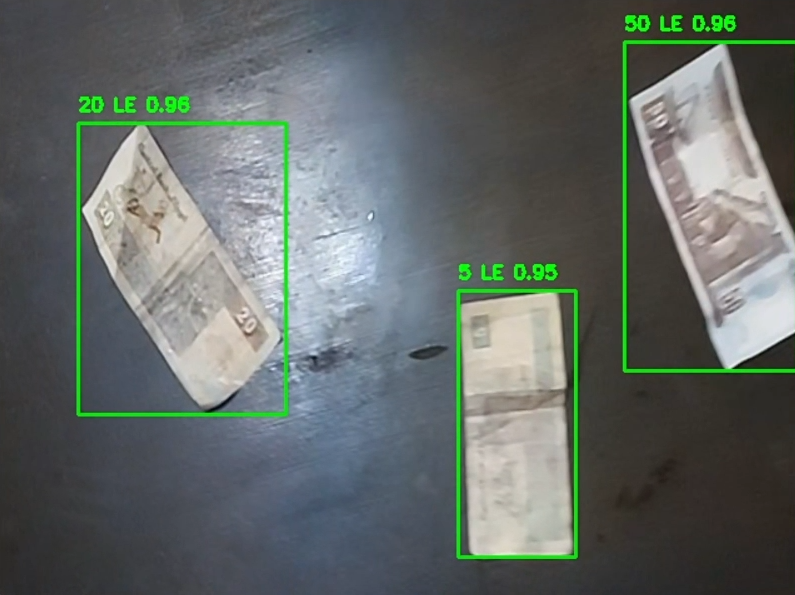
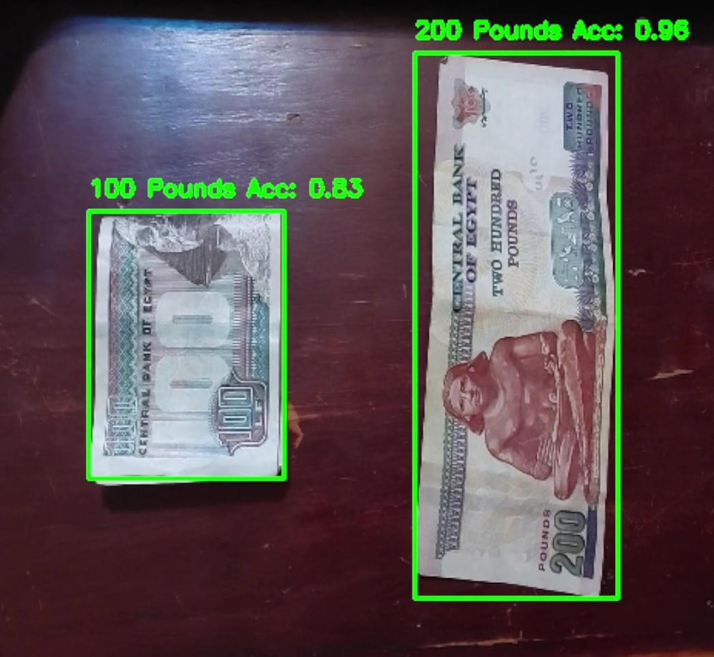

# Egyptian Currency Detection 𓂀 𓁈 𓀛 𓁀 𓁳 𓀮

The application uses **YoloV8 model** to detect Egyptian currencies in real-time using a camera feed.





## Features

- **Real-Time Detection:** The script opens the camera feed and continuously detects Egyptian currency notes within the frame.
- **Total Money Display:** It displays the total sum of money detected in the frame.

<div style="display: flex; justify-content: center; align-items: center;">
    


</div>


- **Text-to-Speech Feature:** Pressing the 't' key triggers a feature that audibly announces the total amount of money detected and lists the detected currencies from right to left (relative to the camera)

### [See Also, Sound Feedback (Video)](https://drive.google.com/file/d/12EAiGe2aaU_pwLoC-RN-uz6NkXMH03Xr/preview)

### Note: -

**"The YOLOv8 model was trained using encoded labels."** To obtain the correct label, use the following mapping:

```python
money = {
    10: "5 Pounds",  1: "5 Pounds",
    0: "10 Pounds",  3: "10 Pounds",
    9: "20 Pounds",  5: "20 Pounds",
    8: "50 Pounds",  2: "50 Pounds",
    4: "100 Pounds", 11: "100 Pounds",
    6: "200 Pounds", 7: "200 Pounds"
}
```

## Dataset

The model was trained on the
[Banha University Egyptian Currency Dataset ](https://universe.roboflow.com/banha-university-dxs4z/egyptian-currency-psnkr/dataset/3)available on Roboflow Universe.

## what you need to install first

- **OpenCV:** To use your camera for detection
- **Ultralytics YOLO (ultralytics):** To use/Train the YoloV8 Model
- **pyttsx3:** To get the Sound Feedback
